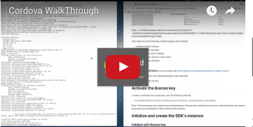
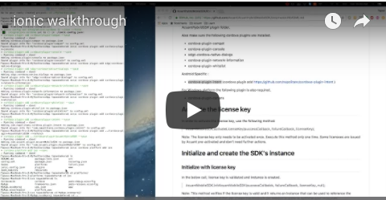
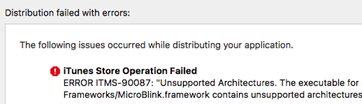

Acuant Hybrid SDK v2.8
----------

**June 2019**

# Introduction

Acuant Web Services supports data extraction from driver’s licenses, state IDs, other government issued IDs, custom IDs, driver’s licenses, barcodes, passports, and medical insurance cards. It also supports document authentication and facial recognition to verify and authenticate the identity.

The Acuant Mobile SDK Plug-in is a Cordova Plug-in designed to simplify your development efforts. The image processing takes place within Acuant Web Services. This document contains a detailed description of all functions that developers need to integrate with the Acuant Hybrid Mobile SDK. The Acuant Hybrid Mobile SDK requires a valid license key. Contact sales@acuantcorp.com to obtain a license key.

**Note** The plug-in will *not* modify the status bar of the application.

## Supported Hybrid Frameworks

The Hybrid Mobile SDK supports following hybrid frameworks:

- Sencha
- Phonegap
- Intel XDK
- ionic
- Mobile Angular UI

## Operating system and device requirements

**Operating System:**  

-	iOS 8.0 or later is required.
-   AndroidSDK Version 17 or later.

**Devices:**

-   iPhone 4S and later
-   iPad 3 and later
-   iPad mini
-   iPod Touch 5G and above

**Camera**

-   5 MP resolution or higher
-   The card image must be taken in an acceptable light conditions to avoid glare and overhead lights for example.
-   The card must preferably be fitted with in the brackets on the camera screen, to allow the picture to be taken at a maximum resolution.

**Note**   All methods require a success and failure callback. You can know which methods were called by checking if “**id**” equals the name of the executed method.

**Example**

		var success = function(data) {
    	log("success: " + data.id);
    		if (typeof data === 'object') {
        		if (data.id == 'mobileSDKWasValidated') {
            		$("\#progress\_modal").toggleClass("hdn");
            		$('\#progress\_modal').nsProgress('dismiss');
            		if(data.data === true) {
                		log('Framework validated');
            		}else {
                		log('Framework is not validated');
            		}
        		}
    		}
		}

## Integration

**Note**  GitHub has recently changed the versioning for large files. You must ***first*** install git-lfs on the build machine in order to download large files while cloning from GitHub repositories. See [https://git-lfs.github.com/](https://git-lfs.github.com/) for more information about git-lfs.

After you clone the repository, execute the following command to make sure all files are pulled:

	git lfs pull
	

	
## Common Errors

If git-lfs is not set up, then GitHub won't download large files. If the following build error occurs while building the iOS app, it indicates that some of the files are missing. 

	ld: warning: ignoring file ../com.acuant.plugin.AcuantMobileSDK/AcuantMobileSDK.framework/AcuantMobileSDK, file was built for unsupported file format ( 0x76 0x65 0x72 0x73 0x69 0x6F 0x6E 0x20 0x68 0x74 0x74 0x70 0x73 0x3A 0x2F 0x2F ) which is not the architecture being linked (armv7): ../com.acuant.plugin.AcuantMobileSDK/AcuantMobileSDK.framework/AcuantMobileSDK
	Undefined symbols for architecture armv7:

	"_OBJC_CLASS_$_AcuantCardProcessRequestOptions", referenced from:

		objc-class-ref in AcuantMobileSDK.o

	"_OBJC_CLASS_$_AcuantMobileSDKController", referenced from:

		objc-class-ref in AcuantMobileSDK.o
	ld: symbol(s) not found for architecture armv7
	clang: error: linker command failed with exit code 1 (use -v to see invocation)
	

If the following error occurs when publishing the app, then the XCode build setting the architectures are not set correctly. You must either set valid CPU architectures or use the "**lipo**" command-line tool to remove the unsupported architecture library.

	
		lipo -remove i386 <Path to the file> -o <Output file path>
		lipo -remove x86_64 <Path to the file> -o <Output file path>

####Add the AcuantMobileSDK plug-in to each project 

1. Clone the Git repository.
2. Locate the path to cordova-plugin-AcuantMobileSDK.
3. Add the plug-in from local folder using the form:  **cordova plugin add** *<path to cordova-plugin-AcuantMobileSDK>* for example:

		cordova plugin add ../cordova-plugin-AcuantHybridSDK --nofetch

1. Make sure the following Cordova plug-ins are installed:
	- **cordova-plugin-compat**
	- **cordova-plugin-console**
	- **sdgc-cordova-native-dialogs**
	- **cordova-plugin-network-information**
	- **cordova-plugin-whitelist**

##Operating system notes

**iOS**

- Remove the **cordova-plugin-console** from your project for Cordova iOS version 4.5.0 and above; otherwise your project will not build. See [https://cordova.apache.org/announcements/2017/09/08/ios-release.html](https://cordova.apache.org/announcements/2017/09/08/ios-release.html)

**Android**

- Add the **cordova-plugin-intent** 
See [https://github.com/napolitano/cordova-plugin-intent](https://github.com/napolitano/cordova-plugin-intent) )

## Initialize and create the SDK instance

Use one of the following methods to validate the license key and create an SDK instance.

####Initialize and create the SDK instance with a license key

	AcuantMobileSDK.initAcuantMobileSDK(successCallbalck, failureCallback, licenseKey, null);

**Note**  Use this method to verify whether the license key is valid and it returns an instance that can be used to reference the methods. Acuant recommends that you create one instance per session in order to optimize your resources.

####Initialize and create the SDK instance with license key and cloud address

In the below call, license key is validated, the instance is created
with the specified cloud address if you are hosting Acuant web services
in your own data center. By default, the hybrid Mobile SDK communicates with the
Acuant data center.

	AcuantMobileSDK.initAcuantMobileSDK(successCallbalck, failureCallback, licenseKey, "cloud.myAddress.com");

**Note**   Do <em>not</em> include the **“https://”** as part of the cloud address. The correct form is:
**cloud.myAddress.com**.

**Note**  Use this method to verify whether the license key is valid and it returns an instance that can be used to reference the methods. Acuant recommends that you create one instance per session to optimize your resources.

## Verify the license key validation

To verify that the license key validation is complete or to determine if it was successful, check the id variable in the returned data object. For example, this ID was sent after the instance of the MobileSDK was created:

	var success = function (data) {
		if (data.id == 'mobileSDKWasValidated'){
		
		}
	}

# Capturing and cropping a card

You need to know the card type that you want to capture to show the camera interface. Use the *manual* camera interface to capture a driver’s license, medical card, or passport. 

## Add the card capture method

Set the card type as an integer value:  **1** = Medical Insurance Card | **2** = Drivers License Card | **3** = Passport Card

Depending on the selected region and the variable state (**isBackSide**), it will show the correct camera interface.

- For `AcuantCardTypeMedicalInsuranceCard`, use the **manual** capture interface.
- For `AcuantCardTypeDriversLicenseCard`, depending on the region, use either the **manual** capture interface and the **barcode** capture interface as described below:
	- For IDs from the USA and Canada, use the **manual** capture interface for the front side and use **barcode** capture or **manual** capture interface for the back side.
	- For IDs from South America, Europe, Asia, Australia, and Africa, use the **manual** capture interface for both front and back sides.
	- For `AcuantCardTypePassportCard` you may *only* use the **manual** capture interface.

### Show card capture interface with SDK initialization

You can initialize the SDK and show the camera interface in a single step by using the following method:

	AcuantMobileSDK.initAcuantMobileSDKAndShowCardCaptureInterfaceInViewController(successCallback, failure,licenseKey, cardType, region, isBackSide);

**Note**  To use any customization method, you should create a previous instance of the SDK in order to set the camera customization.

### Manual Card capture interface without SDK initialization

You must initialize the SDK and create an instance of the SDK before you can call this function:

	AcuantMobileSDK.showManualCameraInterfaceInViewController(successCallback, failure, cardType, region, isBackSide);

### Barcode capture interface without SDK initialization

You must initialize the SDK and create an instance of the SDK before you can call this function:

	AcuantMobileSDK.showBarcodeCameraInterfaceInViewController(successCallback, failure, cardType, region, isBackSide);

###  Set the card size

For all camera interfaces, add the following methods to set the size of the card. 

**Note**  The AcuantMobileSDK can't process a card if the proper card size isn't set.

**Driver's License cards**

	if(isAssureIDAllowed){
        AcuantMobileSDK.setWidth(successCallback, failureCallback, 2024);
    }else{
        AcuantMobileSDK.setWidth(successCallback, failureCallback, 1250);
    }

**Medical Insurance cards**

	AcuantMobileSDK.setWidth(successCallback, failureCallback, 1500);

**Passport documents**

	AcuantMobileSDK.setWidth(successCallback, failureCallback, 1478);

### Customizing the appearance and message on the camera screen 

Optionally, you can add the following methods to customize the appearance and content of the messages displayed on the camera screen. 

**Values**:

- Orientation values must be an integer 0 - 1 (Landscape - 0, Portrait – 1)
- BackgroundColorRed values must be float 0 255
- BackgroundColorGreen values must be float 0 255
- BackgroundColorBlue values must be float 0 255
- BackgroundColorAlpha values must be float 0 – 255

####Customize the initial message

Use the following method to customize the text, duration, background color, position, and orientation of the initial message. The default implementation displays "Align and Tap" or “Tap to Focus.”

**iOS**

		AcuantMobileSDK.setInitialMessage(successCallback, failureCallback, initialMessage, frameX, frameY,
		frameWidth, frameHeight, backgroundColorRed, backgroundColorGreen, backgroundColorBlue, 
		backgroundColorAlpha, duration, orientation);

**Android**

		AcuantMobileSDK.setInitialMessage(successCallback, failureCallback, initialMessage, frameX, frameY,
		frameWidth, frameHeight, backgroundColorRed, backgroundColorGreen, backgroundColorBlue,
		backgroundColorAlpha, duration, orientation);

####Customize the capturing message

Use the following method to customize the text, duration, background color, position, and orientation of the capturing message. The default implementation displays "hold steady".

**iOS**

		AcuantMobileSDK.setCapturingMessage(successCallback, failureCallback, capturingMessage, frameX, frameY, frameWidth, frameHeight, backgroundColorRed, backgroundColorGreen, backgroundColorBlue, backgroundColorAlpha, duration, orientation);

**Android**

	AcuantMobileSDK.setCapturingMessage(successCallback, failureCallback, capturingMessage, frameX, frameY, frameWidth, frameHeight, backgroundColorRed, backgroundColorGreen, backgroundColorBlue, backgroundColorAlpha, duration, orientation);

####Enabling and customizing the flashlight button

You can optionally enable and customize the flashlight button. Use the following methods for all camera interfaces. 

#####Enable the flashlight button (default customization):

	AcuantMobileSDK.showFlashlightButton(successCallback, failure, showFlashlightButton);

#####Customize the flashlight button image:

	AcuantMobileSDK.imageForFlashlightButton(successCallback, failure, flashlightButtonImageOn, flashlightButtonImageOff);

#####Customize the flashlight button frame:

	AcuantMobileSDK.frameForFlashlightButton(successCallback, failure, frameX, frameY, frameWidth, frameHeight);

###Enabling and customizing the barcode camera interface

You can optionally enable the barcode camera interfaces enable barcode image cropping (disabled by default). You can also customize the initial message, pause and resume the scanning, and show or hide iPad brackets.

####Enable the barcode camera interface
	AcuantMobileSDK.setCanCropBarcode(success, failure, true);

####Enable the initial message on the barcode camera interface 
	AcuantMobileSDK.setCanShowMessage(success, failure, true);

####Pause the scanning of the barcode camera
	AcuantMobileSDK.pauseScanningBarcodeCamera(success, failure);

####Resume the scanning of the barcode camera
	AcuantMobileSDK.resumeScanningBarcodeCamera(success, failure);

####Show or hide the iPad brackets on the card capture interface
	AcuantMobileSDK.showiPadBrackets(success, failure, true);
	
####Getting the image capture event from the success callback

When the image capture process starts after user taps on the camera screen, the event can be captured as shown:

	var success = function (data) {
		if(data.id=='onCardImageCaptured')
			{ 
				// Custom code here
			}
	};

####Getting the cropped image from the success callback

The cropped image returned is in base-64 format.

	var success = function(data) {
     log("success: " + data.id);
     if (typeof data === 'object') {
         if (data.id == 'didCaptureCropImage') {
             $("\#progress\_modal").toggleClass("hdn");
             $('\#progress\_modal').nsProgress('dismiss');
             if (typeof data.data === 'string') {
                 if (isFrontSide) {
                     frontCardImage = data.data;
                     isBarcodeSide = data.scanBackSide;
                     var srcFront = "data:image/png;base64," + data.data;
                     var imgFront = $('&lt;img class="bordered" src="' + srcFront +
                         '"&gt;');
                     $("\#front-image").empty();
                     $("\#front-image").prepend(imgFront);
                     $("\#front-image").removeClass("bordered");
                     if (cardType == 2) {
                         navigator.notification.alert(
                             'Scan the backside of the license.',
                             showCameraInterfaceDLBack,
                             'AcuantHybridSampleSDK',
                             'OK'
                        );
                     }
                 } else {
                     backCardImage = data.data;
                     var srcBack = "data:image/png;base64," + data.data;
                     var imgBack = $('&lt;img class="bordered" src="' + srcBack + '"&gt;');
                     $("\#back-image").show();
                     $("\#back-image").empty();
                     $("\#back-image").prepend(imgBack);
                     $("\#back-image").removeClass("bordered");
                 }
             }
         }
     }
    };

###Getting the original image from the success callback

The original image returned is in base-64 format.

	 var success = function(data) {
     log("success: " + data.id);
     if (typeof data === 'object') {
         if (data.id == 'didCaptureOriginalImage') {
             if (typeof data.data === 'string') {
                 originalImage = data.data;
             }
         }
     }
    }
    
 **Note** By default, the capture of original image is disabled. See the following example to enable capturing the original image.
 
###Getting the glare and sharpness data from the success callback

Use the following method to get the glare and sharpness data for an image:

	var success = function(data) {
		if (data.id == 'didCaptureCropImage') { 
			var hasGlare = data.HAS_GLARE;
			var glareGrade = data.GLARE_GRADE;
			var isSharpImage = data.IS_SHARP; 
			var sharpnessGrade = data.SHARPNESS_GRADE;
			}
		}

These parameters specify the sharpness and glare threshold of a cropped image. An image with a sharpness grade of 0.4f for iOS and 0.3f for Android or above is considered a sharp image. 

A glare grade of 0.92f for iOS and 0.88f for Android and above means there is no glare. Users may set the threshold based on their requirements. 

###Getting the barcode data from the success callback

Use the following method to retrieve the cropped image captured by all card capture interfaces:

	 var success = function(data) {
     log("success: " + data.id);
     if (typeof data === 'object') {
         if (data.id == 'didCaptureData') {
             if (typeof data.data === 'string') {
                 barcodeStringData = data.data;
             }
         }
     }
    }
    

# Card Processing methods 

This section describes how to add a card processing method. See the **Parameters** section below for complete information about parameters.

###Add the card processing method
Use the following syntax to add a card processing method:

	processCardImage(successCallback, failureCallback, frontImage, backImage, barcodeStringData, autoDetectState, stateID, reformatImage, reformatImageColor, DPI, cropImage, faceDetection, signatureDetection, region, logTransaction,imageSettings);

####Driver's License cards

	AcuantMobileSDK.processCardImage(success, failure, frontImage, backImage, barcodeStringData, autoDetectState, stateID, reformatImage, reformatImageColor, DPI, cropImage, faceDetection, signatureDetection, region,logTransaction,imageSettings);

	####Example

	AcuantMobileSDK.processCardImage(success, failure, 2, backCardImage, barcodeStringData, true, -1, true, 0, 150, false, true, true, 0, true,-1);

####Medical Insurance cards

	AcuantMobileSDK.processCardImage(success, failure, frontImage, backImage, barcodeStringData, autoDetectState, stateID, reformatImage, reformatImageColor, DPI, cropImage, faceDetection, signatureDetection, region, imageSource);

	#####Example

	AcuantMobileSDK.processCardImage(success, failure, 1, backCardImage, barcodeStringData, true, -1, true, 0, 150, false, true, true, 0, 101);

###Passports

	AcuantMobileSDK.processCardImage(success, failure, frontImage, backImage, barcodeStringData, autoDetectState, stateID, reformatImage, reformatImageColor, DPI, cropImage, faceDetection, signatureDetection, region, imageSource);

	#####Example

	AcuantMobileSDK.processCardImage(success, failure, 3, backCardImage, barcodeStringData, true, -1, true, 0, 150, false, true, true, 0, 101);

##Check the callback process

Check the callback process asking if **data.id** is equal to **didFinishProcessingCardWithResult**.

####Driver's License cards

	if (cardType == 2) {
		frontCardImageResult = cardResult.licenceImage;
		backCardImageResult = cardResult.licenceImageTwo;
		faceImageResult = cardResult.faceImage;
		signatureImageResult = cardResult.signatureImage; 
		resultString = "First Name - " + cardResult.nameFirst + "&lt;/br&gt;Middle Name - " + cardResult.nameMiddle + "&lt;/br&gt;Last Name - " + cardResult.nameLast + "&lt;/br&gt;Name Suffix - " + cardResult.nameSuffix + "&lt;/br&gt;ID - " + cardResult.licenceId + "&lt;/br&gt;License - " + cardResult.license + "&lt;/br&gt;DOB Long - " + cardResult.dateOfBirth4 + "&lt;/br&gt;DOB Short - " + cardResult.dateOfBirth + "&lt;/br&gt;Date Of Birth Local - " + cardResult.dateOfBirthLocal + "&lt;/br&gt;Issue Date Long - " + cardResult.issueDate4 + "&lt;/br&gt;Issue Date Short - " + cardResult.issueDate + "&lt;/br&gt;Issue Date Local - " + cardResult.issueDateLocal + "&lt;/br&gt;Expiration Date Long - " + cardResult.expirationDate4 + "&lt;/br&gt;Expiration Date Short - " + cardResult.expirationDate + "&lt;/br&gt;Eye Color - " + cardResult.eyeColor + "&lt;/br&gt;Hair Color - " + cardResult.hairColor + "&lt;/br&gt;Height - " + cardResult.height + "&lt;/br&gt;Weight - " + cardResult.weight + "&lt;/br&gt;Address - " + cardResult.address + "&lt;/br&gt;Address 2 - " + cardResult.address2 + "&lt;/br&gt;Address 3 - " + cardResult.address3 + "&lt;/br&gt;Address 4 - " + cardResult.address4 + "&lt;/br&gt;Address 5 - " + cardResult.address5 + "&lt;/br&gt;Address 6 - " + cardResult.address6 + "&lt;/br&gt;City - " + cardResult.city + "&lt;/br&gt;Zip - " + cardResult.zip + "&lt;/br&gt;State - " + cardResult.state + "&lt;/br&gt;County - " + cardResult.county + "&lt;/br&gt;Country Short - " + cardResult.countryShort + "&lt;/br&gt;Country Long - " + cardResult.idCountry + "&lt;/br&gt;Class - " + cardResult.licenceClass + "&lt;/br&gt;Restriction - " + cardResult.restriction + "&lt;/br&gt;Sex - " + cardResult.sex + "&lt;/br&gt;Audit - " + cardResult.audit + "&lt;/br&gt;Endorsements - " + cardResult.endorsements + "&lt;/br&gt;Fee - " + cardResult.fee + "&lt;/br&gt;CSC - " + cardResult.CSC + "&lt;/br&gt;SigNum - " + cardResult.sigNum + "&lt;/br&gt;Text1 - " + cardResult.text1 + "&lt;/br&gt;Text2 - " + cardResult.text2 + "&lt;/br&gt;Text3 - " + cardResult.text3 + "&lt;/br&gt;Type - " + cardResult.type + "&lt;/br&gt;Doc Type - " + cardResult.docType + "&lt;/br&gt;Father Name - " + cardResult.fatherName + "&lt;/br&gt;Mother Name - " + cardResult.motherName + "&lt;/br&gt;NameFirst\_NonMRZ - " + cardResult.nameFirst\ _NonMRZ + "&lt;/br&gt;NameLast\_NonMRZ - " + cardResult.nameLast\ _NonMRZ + "&lt;/br&gt;NameLast1 - " + cardResult.nameLast1 + "&lt;/br&gt;NameLast2 - " + cardResult.nameLast2 + "&lt;/br&gt;NameMiddle\_NonMRZ - " + cardResult.nameMiddle\ _NonMRZ + "&lt;/br&gt;NameSuffix\_NonMRZ - " + cardResult.nameSuffix\ _NonMRZ + "&lt;/br&gt;Document Detected Name - " + cardResult.documentDetectedName + "&lt;/br&gt;Nationality - " + cardResult.nationality + "&lt;/br&gt;Original - " + cardResult.original + "&lt;/br&gt;PlaceOfBirth - " + cardResult.placeOfBirth + "&lt;/br&gt;PlaceOfIssue - " + cardResult.placeOfIssue + "&lt;/br&gt;Social Security - " + cardResult.socialSecurity + "&lt;/br&gt;IsAddressCorrected - " + cardResult.isAddressCorrected + "&lt;/br&gt;IsAddressVerified - " + cardResult.isAddressVerified;

     if (cardRegion == 0 || cardRegion == 1) {
         resultString = resultString + "&lt;/br&gt;IsBarcodeRead - " + cardResult.isBarcodeRead + "&lt;/br&gt;IsIDVerified - " + cardResult.isIDVerified + "&lt;/br&gt;IsOcrRead - " + cardResult.isOcrRead;
     }
     resultString = resultString + "&lt;/br&gt;Document Verification Confidence Rating - " + cardResult.documentVerificationRating;
     }

###Medical Insurance cards

    if (cardType == 1) {
        frontCardImageResult = cardResult.reformattedImage;
        backCardImageResult = cardResult.reformattedImageTwo;
        resultString = "First Name - " + cardResult.firstName + "&lt;/br&gt;Last Name - " + cardResult.lastName + "&lt;/br&gt;Middle Name - " + cardResult.middleName + "&lt;/br&gt;MemberID - " + cardResult.memberId + "&lt;/br&gt;Group No. - " + cardResult.groupNumber + "&lt;/br&gt;Contract Code - " + cardResult.contractCode + "&lt;/br&gt;Copay ER - " + cardResult.copayEr + "&lt;/br&gt;Copay OV - " + cardResult.copayOv + "&lt;/br&gt;Copay SP - " + cardResult.copaySp + "&lt;/br&gt;Copay UC - " + cardResult.copayUc + "&lt;/br&gt;Coverage - " + cardResult.coverage + "&lt;/br&gt;Date of Birth - " + cardResult.dateOfBirth + "&lt;/br&gt;Deductible - " + cardResult.deductible + "&lt;/br&gt;Effective Date - " + cardResult.effectiveDate + "&lt;/br&gt;Employer - " + cardResult.employer + "&lt;/br&gt;Expire Date - " + cardResult.expirationDate + "&lt;/br&gt;Group Name - " + cardResult.groupName + "&lt;/br&gt;Issuer Number - " + cardResult.issuerNumber + "&lt;/br&gt;Other - " + cardResult.other + "&lt;/br&gt;Payer ID - " + cardResult.payerId + "&lt;/br&gt;Plan Admin - " + cardResult.planAdmin + "&lt;/br&gt;Plan Provider - " + cardResult.planProvider + "&lt;/br&gt;Plan Type - " + cardResult.planType + "&lt;/br&gt;RX Bin - " + cardResult.rxBin + "&lt;/br&gt;RX Group - " + cardResult.rxGroup + "&lt;/br&gt;RX ID - " + cardResult.rxId + "&lt;/br&gt;RX PCN - " + cardResult.rxPcn + "&lt;/br&gt;Telephone - " + cardResult.phoneNumber + "&lt;/br&gt;Web - " + cardResult.webAddress + "&lt;/br&gt;Email - " + cardResult.email + "&lt;/br&gt;Address - " + cardResult.fullAddress + "&lt;/br&gt;City - " + cardResult.city + "&lt;/br&gt;Zip - " + cardResult.zip + "&lt;/br&gt;State - " + cardResult.state;
    }

####Passports

	if (cardType == 3) {
     frontCardImageResult = cardResult.passportImage;
     faceImageResult = cardResult.faceImage;
     signatureImageResult = cardResult.signImage;
     resultString = "First Name - " + cardResult.nameFirst + "&lt;/br&gt;Middle Name - " + cardResult.nameMiddle + "&lt;/br&gt;Last Name - " + cardResult.nameLast + "&lt;/br&gt;Passport Number - " + cardResult.passportNumber + "&lt;/br&gt;Personal Number - " + cardResult.personalNumber + "&lt;/br&gt;Sex - " + cardResult.sex + "&lt;/br&gt;Country Long - " + cardResult.countryLong + "&lt;/br&gt;Nationality Long - " + cardResult.nationalityLong + "&lt;/br&gt;DOB Long - " + cardResult.dateOfBirth4 + "&lt;/br&gt;Issue Date Long - " + cardResult.issueDate4 + "&lt;/br&gt;Expiration Date Long - " + cardResult.expirationDate4 + "&lt;/br&gt;Place of Birth - " + cardResult.end\ _POB;

 }

####Parameters

- **autoDetectState** - Boolean value that indicates whether to auto detect the state of the ID.  **Values**: True | False (SDK wont auto detect the state of the ID and will use the value of **ProcState** integer)

- **cropImage –** Boolean value that indicates whether to crop the RAW image. **Values**: True | False   **Note** The Mobile SDK crops the image; therefore, leave this flag set to **False**.

- **DPI -** Integer value that indicates the DPI value to reformat the image.  **Values**: 150 - 600  **Note** The size of the image is dependent on the DPI value. Use a lower value (150 DPI) for a smaller image. 

- **faceDetection** - Boolean value that indicates whether a face image is returned. **Values**: True | False

- **signatureDetection** - Boolean value that indicates whether a signature image is returned. **Values**: True | False

- **reformatImage** - Boolean value  that indicates whether a formatted image is returned.  **Values**: True | False (ignores value of ReformatImageColor and ReformatImageDpi)

- **reformatImageColor** - Integer value that specifies the color value to reformat the image. **Values**: Image same color – 0 | Black and White – 1 | Gray scale 256 – 2 | Color 256 – 3 | True color – 4 | Enhanced Image – 5

- **region** - Integer parameter for the Region ID. **Values:** United States – 0 | Australia – 4 | Asia – 5 | Canada – 1 | America – 2 | Europe – 3 | Africa – 7 | General Documents – 6

- **signatureDetection** - Boolean value that indicates whether a signature image is returned. **Values**: True | False

- **sourceImage –** Defines the source or type of image **Values**: MobileSDK – 101

- **stateID** - Integer value of the state to which the ID belongs. **Values**: True | False  
	- If **AutoDetectState** is **True**, then the SDK automatically detects the state of the ID and stateID value is ignored. 
	- If **AutoDetectState** is **False**, then the SDK uses stateID integer value for processing.

**Note**   For a complete list of the different countries supported by the SDK and their different State integer values, the ScanW document - <http://www.id-reader.com/ftp/applications/sdk/docs/ScanW.pdf>  

####Failure cases

If the image process fails for any reason you can then check the error in the failure callback by asking if **error.id** is equal to **didFailWithError**.

		 var failure = function(data) {
         if (data.id == ‘didFailWithError’) {
             log("Process error type:" + data.errorType + " Message: " + data.errorMessage);
             alert(data.errorMessage);
             \
             $('\#progress\_modal').nsProgress('dismiss');
         } else if (data.errorType) {
             log("Error Type:" + data.errorType + " Message: " + data.errorMessage);
             alert(data.errorMessage);
             \
             $('\#progress\_modal').nsProgress('dismiss');
         } else {
             {
                 log("failure: " + data.error);
             }
         };

## AssureID Authentication results

Use the **AuthenticationResult** and **AuthenticationResultSummary** fields to see AssureID authentication results for driver's licenses and passports.

- **AuthenticationResult**

	**Values**: Passed | Failed | Attention | Unknown | Skipped

- **AuthenticationResultSummary**

    Returns the list of reasons when **AuthenticationResult** returns an *Attention* result. 

**Note**  The **AuthenticationResultSummary** will be empty for **Passed**, **Failed**, **Unknown**, and **Skipped** results.

##  Capture Device Location Tracking

If it is required to detect the location at which the ID/Passport is captured, location tracking can be enabled.

	AcuantMobileSDKController.enableLocationTracking(null,null);
		
		
**Note** Add the following key and a corresponding value in the application .plist file to enable location tracking in iOS.

	NSLocationAlwaysUsageDescription
		
**Note** Give permission to the application for location tracking in both iOS and Android

If **enableLocationTracking** is called, then location details can be accessed from the returned card:

	var deviceCity = cardResult.DeviceCity;
	var deviceArea = cardResult.DeviceArea;
	var deviceState = cardResult.DeviceState;
	var deviceCountry = cardResult.DeviceCountry;
	var countryCode = cardResult.DeviceCountryCode;
	var deviceZipCode = cardResult.DeviceZipcode;
	var address = cardResult.DeviceStreetAddress;
			
			
The following are location test fields for the **AcuantCardResult** class:
			
	idLocationStateTestResult // if ID/Passport State matched with Device state
	idLocationCountryTestResult // if ID/Passport Country matched with Device Country
	idLocationCityTestResult // if ID/Passport City matched with Device City
	idLocationZipcodeTestResult // if ID/Passport zip code matched with Device zip code

# Facial Recognition and Match

Acuant FRM (Facial Recognition Match) is a person authentication solution for mobile devices based on biometric facial recognition. Acuant FRM reduces fraud by matching the face biometrics to the face image on the driver’s license or passport. It performs real-time checks and processes the data within seconds. This secure solution is easy to integrate using the Acuant Android Mobile SDK.

Acuant FRM performs following checks to recognize a live face and match face biometrics to the face picture on the driver’s license or passport.

- **Face position checks** ensure that the face is well detected, correctly centered, and at the appropriate distance from the camera.
- **Distance-to-person algorithm** ensures that individual’s face is at optimal distance from the front camera. 
- **Frontal face presentation** Ensures that individual is only presenting frontal face (Side faces are rejected).
- **Eye blink tracking** checks for face liveliness to avoid spoofing attacks.
- **Face biometrics capture** matches biometric data to the face image on a driver’s license or passport.

Following are the APIs to use the Facial Match feature. 	

* 	**setFacialRecognitionTimeout**
	* 	Sets the timeout, in seconds, for facial recognition

			AcuantMobileSDK.setFacialRecognitionTimeout(success, failure,20);
		
* 	**setFacialInstructionText**
	* 	Sets the instruction text for the user

			AcuantMobileSDK.setFacialInstructionText(success, failure,"Get closer until Red Rectangle appears and Blink");
    
* 	**setFacialInstructionLocation**
	* 	Sets the location for instruction text. **Note** The location will vary based on device type.

			AcuantMobileSDK.setFacialInstructionLocation(success, failure,120,100);
		
* 	**setFacialInstructionTextStyle**
	* 	Sets the color and size of the instruction text

			AcuantMobileSDK.setFacialInstructionTextStyle(success,failure,'#ffffff',13);
		
* 	**setFacialSubInstructionString**
	* 	Sets the text for message that appears while red rectangle appears

			AcuantMobileSDK.setFacialSubInstructionString(success, failure,'Analyzing');

* 	**setFacialSubInstructionColor**
	* 	Color of the text that appears while red rectangle appears

			AcuantMobileSDK.setFacialSubInstructionColor(success, failure,'#FF0000');

* 	**showFacialInterface**
	* 	Presents the facial capture interface

			AcuantMobileSDK.showFacialInterface(success, failure);
	
	
	The following methods are called from the facial capture interface: 

	* **onFacialRecognitionCanceled**  -  User canceled facial capture interface
	* **onFacialRecognitionTimedOut**  -  Facial capture interface timed out
	* **onFacialRecognitionCompleted**  -  Facial capture interface finished capturing selfie image successfully

The following method is used to match the selfie image with a face image :

	AcuantMobileSDK.processFacialImageValidation(success, failure, selfieImageData,faceImageResult);
	
	
### Reading e-Passports Chips (*Android only*)

If AssureID is enabled on your **licenseKey**, then information from the chip in an e-Passport can be read by using Acuant Hybrid mobile SDK.

**Scan and read information from a e-passport chip**

1. Ensure the following permission is enter in the application manifest file.
		
		<uses-permission android:name="android.permission.NFC" />

1. Ensure NFC is turned on in the device. The following SDK API can be used to listen to NFC tags available in an e-Passport:
		
		AcuantMobileSDK.scanEChip(success, failure);
		
1. If an NFC tag is successfully discovered, then **onNewIntent** of the Cordova Android activity will be called. This event can be captured as follows:

		- onDeviceReady set as below to handle the Android intent. (Please refer sample app)

			window.plugins.intent.setNewIntentHandler(function (Intent) {
        		console.log(Intent);
        		handleIntent(Intent);
    		});
    	
    	- If the above intent handler is set then the new intent control will come to the following method.(Please refer sample app)

		function handleIntent(Intent){
			if(isAndroid){
        		readEChipAction(Intent);
			}
		}
        

1. Inside the preceding handler method, call the following API to read the NFC e-Passport chip:
			
		 //	documentNumber : Non empty string
	     // dateOfBirth : (yyMMdd)
	     // dateOfExpiry :(yyMMdd)
        AcuantMobileSDK.readEChip(success,failure,Intent,documentNumber,
        dateOfBirth,dateOfExpiry);	
	

### Error Types

**AcuantErrorCouldNotReachServer = 0**

Could not reach server. Check the Internet connection.

	public final static int *AcuantErrorCouldNotReachServer* = 0; 
	
**AcuantErrorUnableToAuthenticate = 1**

The license key information is incorrect.

	public final static int *AcuantErrorUnableToAuthenticate* = 1;
	
**AcuantErrorUnableToProcess = 2**

The image received by the server was unreadable. Take a new one.

	public final static int *AcuantErrorUnableToProcess* = 2;
	
**AcuantErrorInternalServerError = 3**

Server error. Try again later.

	public final static int *AcuantErrorInternalServerError* = 3; 

**AcuantErrorUnknown = 4**
	
An unknown error occurred; unable to determine the reason. Try again later.

	public final static int *AcuantErrorUnknown* = 4; 
	
**AcuantErrorTimedOut = 5**

Request timed out, maybe because Internet connection is too slow.

	public final static int *AcuantErrorTimedOut* = 5;
	
**AcuantErrorAutoDetectState = 6**

An error occurred while trying to detect the state.

	public final static int *AcuantErrorAutoDetectState* = 6;
	
**AcuantErrorWebResponse = 7**

The json that was received by the server contained an error.

	public final static int *AcuantErrorWebResponse* = 7;
	
**AcuantErrorUnableToCrop = 8**

The received image can't be cropped.

	public final static int *AcuantErrorUnableToCrop* = 8;

**AcuantErrorInvalidLicenseKey = 9**

Invalid license key.

	public final static int *AcuantErrorInvalidLicenseKey* = 9;
	
**AcuantErrorInactiveLicenseKey = 10**

Inactive license key.

	public final static int *AcuantErrorInactiveLicenseKey* = 10;

**AcuantErrorAccountDisabled = 11**

Account is disabled.

	public final static int *AcuantErrorAccountDisabled* = 11;
	
**AcuantErrorOnActiveLicenseKey = 12**

Error on activation key.

	public final static int *AcuantErrorOnActiveLicenseKey* = 12;
	
**AcuantErrorValidatingLicensekey = 13**

Validation still in progress.

	public final static int *AcuantErrorValidatingLicensekey* = 13;
	
**AcuantErrorOpenCamera = 16**

Error occurred when camera was opened.

	public static final int AcuantErrorIncorrectDocumentScanned = 16;
	
**AcuantNoneError = 200**

Privacy settings are preventing access to the camera.

----------

Copyright © 2003-2019 Acuant Inc. All rights reserved.

This document contains proprietary and confidential 
information and creative works owned by Acuant and its respective
licensors, if any. Any use, copying, publication, distribution, display,
modification, or transmission of such technology in whole or in part in
any form or by any means without the prior express written permission of
Acuant is strictly prohibited. Except where expressly provided by Acuant
in writing, possession of this information shall not be
construed to confer any license or rights under any Acuant intellectual
property rights, whether by estoppel, implication, or otherwise.

AssureID and *i-D*entify are trademarks of Acuant Inc. Other Acuant product or service names or logos referenced this document are either trademarks or registered trademarks of Acuant.

All 3M trademarks are trademarks of Gemalto Inc.

Certain product, service, or company designations for companies other
than Acuant may be mentioned in this document for identification
purposes only. Such designations are often claimed as trademarks or
service marks. In all instances where Acuant is aware of a claim, the
designation appears in initial capital or all capital letters. However,
you should contact the appropriate companies for more complete
information regarding such designations and their registration status.

**June 2019**

Acuant Inc.

6080 Center Drive, Suite 850

Los Angeles, CA 90045

----------

